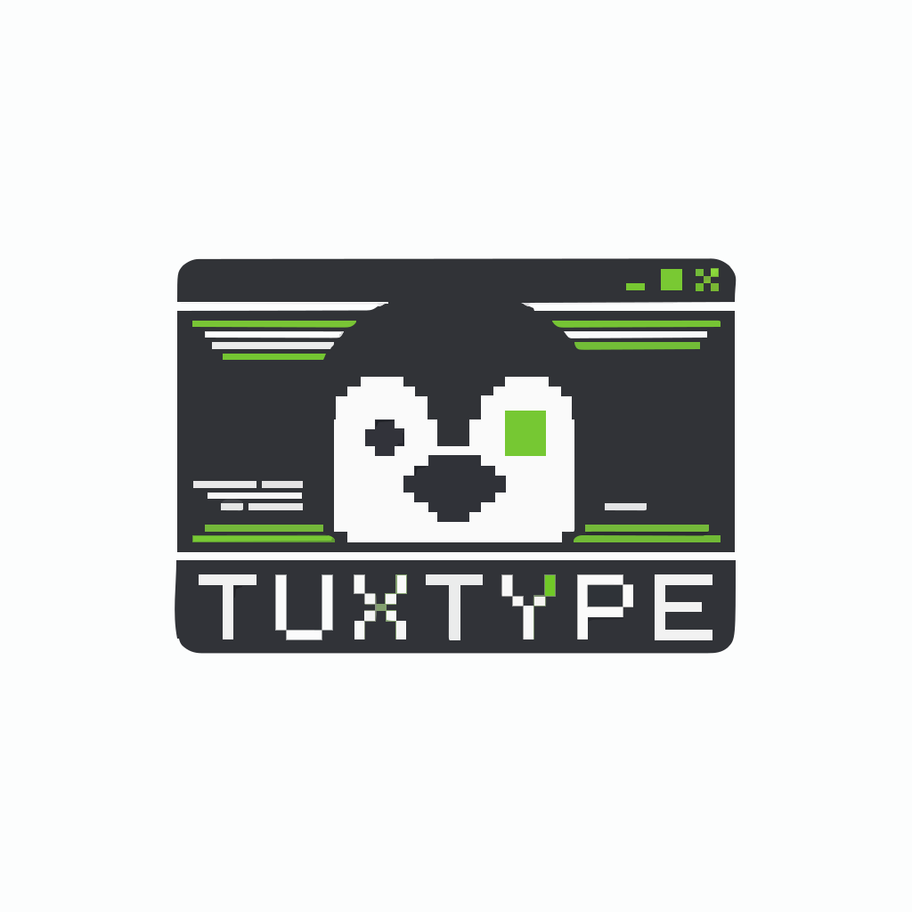

<p align="center">
  
</p>

# TuxType

<p align="center">
  <strong>A beautiful, terminal-based typing speed test inspired by Monkeytype.</strong>
</p>

<p align="center">
  
  
  
</p>

---

## 📖 Description

> [!CAUTION]
> **Vibe Code Alert**: This project is 95% vibe coded and was built overnight as a fun side-project. It's fun and easy to test your typing skill anytime in your terminal.


**TuxType** is a modern, feature-rich terminal typing test application built for developers and keyboard enthusiasts who prefer the command line. Inspired by the aesthetics and functionality of [Monkeytype](https://monkeytype.com), it brings a premium typing experience directly to your terminal.

Whether you want to improve your WPM, track your progress over time, or just enjoy a distraction-free typing session, TuxType has you covered with offline capability, detailed statistics, and extensive customization.

## ✨ Features

- **Multiple Modes**:
  - **Words**: Type a set number of words (10, 25, 50, 100, etc.).
  - **Time**: Type for a fixed duration (15s, 30s, 60s, 120s).
- **Comprehensive Statistics**:
  - Real-time WPM, Accuracy, and Burst tracking.
  - Detailed post-test analysis including raw WPM, consistency, and error breakdown.
  - **Interactive Charts**: Visualize your performance history.
- **Rich History & Progress**:
  - Local database stores all your test results.
  - Track **Personal Bests** for every mode and language combination.
  - View daily activity and streak counters.
- **Customization**:
  - **Themes**: Choose from Dark (default), Light and Dracula.
  - **Language Support**: English and generic Programming syntax.
  - **Modifiers**: Toggle punctuation and numbers.
- **Modern TUI**: Built with **Textual** and **Rich** for a responsive, mouse-supported terminal interface.
- **SSH Compatible**: Works seamlessly over SSH connections for remote typing tests.

## 📸 Demo


## 🛠️ Tech Stack

- **[Python](https://www.python.org/)** - Core logic.
- **[Textual](https://textual.textualize.io/)** - TUI framework for the sophisticated interface.
- **[Rich](https://rich.readthedocs.io/)** - Beautiful terminal formatting and styling.
- **[Click](https://click.palletsprojects.com/)** - Command-line interface creation.

## 🚀 Installation

### From PyPI (Recommended)

```bash
pip install tuxtype==1.0.0
```

### From Source

1.  **Clone the repository**:
    ```bash
    git clone https://github.com/0xMihirK/TuxType.git
    cd TuxType
    ```

2.  **Create a virtual environment** (optional but recommended):
    ```bash
    python -m venv .venv
    # Windows
    .venv\Scripts\activate
    # Linux/Mac
    source .venv/bin/activate
    ```

3.  **Install dependencies**:
    ```bash
    pip install -r requirements.txt
    python tuxtype.py
    ```

## 💻 Usage

### Quick Start

Run the application with the default settings (50 words, English):

```bash
tuxtype
```

### Command Line Options

You can launch TuxType with specific configurations directly from the proper command line:

```bash
# Start a 60-second time trial
tuxtype --mode time --time 60

# Practice with 100 words including punctuation
tuxtype --count 100 --punctuation

# Programming mode
tuxtype --language programming

# View all available options
tuxtype --help
```

_Note through the UI, you can access the **Settings** screen to change these preferences persistently._

## ⚙️ Configuration

TuxType automatically saves your preferences and test history.

- **Config File**: Located at `data/tuxtype.config`.
- **Database**: Test history is stored in a SQLite database in the `data/` directory.

You can modify settings like **Themes**, **Behavior** (min wpm, stop on error), and **Visuals** (caret style, live stats) mainly through the in-app **Settings** menu.

## 📂 Code Structure

```text
TuxType/
├── src/
│   ├── app.py             # Main application class & theme handling
│   ├── main.py            # CLI entry point
│   ├── core/              # Core game logic
│   ├── screens/           # UI Screens (Menu, Test, Results, Settings, etc.)
│   ├── widgets/           # Reusable UI components (Graphs, StatsDisplay)
│   ├── database/          # Database manager & models
│   └── utils/             # Config & logging utilities
├── data/                  # Storage for local DB and config files
├── img/                   # Assets (Logo, Demo GIF)
└── tuxtype.py             # Convenience launch script
```

## 🤝 Acknowledgements

- **[Monkeytype](https://monkeytype.com)** for the heavy inspiration on design and functionality.
- **[Textualize](https://textualize.io)** for building the amazing libraries that power this app.

## 📄 License

This project is licensed under the **MIT License**. See the `LICENSE` file for details.
